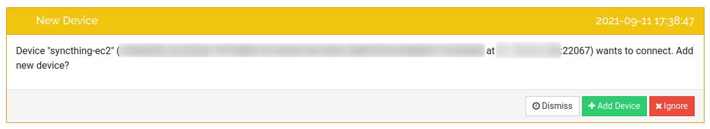

# Syncthing EC2

- [Overview](#overview)
- [Prerequisites](#prerequisites)
- [How to deploy](#how-to-deploy)
- [Reuse Previous syncthing configuration](#reuse-previous-syncthing-configuration)
- [Connect to Tailscale Network](#connect-to-tailscale-network)
- [License](#license)
- [Contribution](#contribution)

## Overview

This solution tries to simplify the creation and initial setup of a Syncthing node on the Public Cloud (AWS). It uses Terraform to provision the necessary resources on AWS. The Syncthing software is installed in a Docker container on the created EC2 (using `docker-compose`). After the Syncthing container is up and running the [Synthing API](https://docs.syncthing.net/dev/rest.html) is used to retrieve relevant information (device id & name), set up GUI username/password and automatically pair with existing Syncthing device.

## Prerequisites

This project assumes that you are already familiar and using Syncthing on your local devices. If you want more information you can check the [Getting Started Guide](https://docs.syncthing.net/intro/getting-started.html)

Technical requirements:

* AWS Account and working `aws-cli`
* Terraform ([Installation Guide](https://learn.hashicorp.com/tutorials/terraform/install-cli))
* Create an S3 Bucket on your account (to be used for Terraform State and Artifacts)

## How to deploy

1. Run `init.sh` (one-time) to perform the initial configuration:

``` bash
./init.sh \
  -e <environment-name> \
  -s <s3-bucket-name> \
  -u <syncthing-gui-username> \
  -p <syncthing-gui-password> \
  -i <local-syncthing-device-id> \
  -n <local-syncthing-device-name> \
  -t <tailscale-access-token>
```

Argument Explanation:
| Argument Name                      | Description                                                  | Example                                                      |
| ---------------------------------- | ------------------------------------------------------------ | ------------------------------------------------------------ |
| `-e <environment-name>`            | Specify the environment name (used for naming convention). If not specified "dev" is used. | `dev`                                                        |
| `-s <s3-bucket-name>`              | S3 Bucket name (to be used for Terraform state and artifacts). Creates an SSM Parameter with this value (to be referenced by other scripts) | `my-s3-bucket-name`                                          |
| `-u <syncthing-gui-username>`      | Username for Syncthing GUI. Creates an SSM Parameter with this value (to be referenced by other scripts) | `myusername`                                                 |
| `-p <syncthing-gui-password>`      | Password for Syncthing GUI. Creates an SSM Parameter with this value (to be referenced by other scripts) | `mysecurepassword`                                           |
| `-i <local-syncthing-device-id>`   | Your local Syncthing device-id with which you want to pair your EC2. Creates an SSM Parameter with this value (to be referenced by other scripts) | `MFZWI3D-BONSGYC-YLTMRWG-C43ENR5-QXGZDMM-FZWI3DP-BONSGYY-LTMRWAD` |
| `-n <local-syncthing-device-name>` | Your local Syncthing device-name with which you want to pair your EC2. Creates an SSM Parameter with this value (to be referenced by other scripts) | `my-local-device`                                            |
| `-t <tailscale-token>`             | Your token for authenticating on your Tailscale network. If is recommended to assign an ephemeral token. | `tskey-auth-xxx`                                             |

2. Review `terraform-manifests/envs/<env>.tfvars`

This is the file that provides the read of the input to Terraform (besides the ones already set on `init.sh`)

Argument Explanation:

| Argument Name             | Type    | Description                                                  | Example     |
| ------------------------- | ------- | ------------------------------------------------------------ | ----------- |
| `resource_name`           | String  | Naming convention for the AWS Resources to be created        | `syncthing` |
| `instance_type`           | String  | EC2 Instance Type. Check the [AWS Documentation](https://aws.amazon.com/ec2/instance-types/) for more information. | `t3.nano`   |
| `volume_size`             | Number  | EC2 Volume Size (in GBs)                                     | `10`        |
| `connect_to_instance`     | Boolean | Configure the necessary Security Group rules to connect to the created ec2 instance. If set to `true` Terraform will create an EC2 Security Group rule to allow the local machine to access the EC2 instance on port 8384 (used by Syncthing). If set to `false` all inbound communications to the EC2 Instance are blocker (for increased security) | `true`      |
| `create_syncthing_config` | Boolean | Create a new syncthing instance configuration, if set to false the configuration will be take from AWS SSM and S3. | `false`     |
| `connect_to_tailscale`    | Boolean | Run the necessary commands in the EC2 Instance to connect to the Tailscale Network. | `true`      |


3. Finally you need to run the following command to create/update or destroy (in subsequent call) your infrastructure:

``` bash
./deploy.sh -e <environment-name>
```

Argument Explanation:

| Argument Name           | Description                                                  | Example |
| ----------------------- | ------------------------------------------------------------ | ------- |
| `-e <environment-name>` | (Mandatory) Specify the environment name (used for naming convention). If not specified "dev" is used. | `dev`   |
| `-d`                    | (Optional) Performs Terraform destroy to remove the infrastructure, if not defined a Terraform apply is performed. |         |

This final command will trigger the Terraform manifests which will create:

* EC2 Security Group
* EC2 IAM Role/Instance Profile
* EC2 Instance

After running this command, you should see your terminal an output similar to the following:

```text
Syncthing EC2 Instance Information:
{
  "deviceID": "MFZWI3D-BONSGYC-YLTMRWG-C43ENR5-QXGZDMM-FZWI3DP-BONSGYY-LTMRWAD",
  "name": "syncthing-ec2",
  "public_ip": "1.2.3.4"
}
To connect to the syncthing web gui visit: https://1.2.3.4:8384
```

Here you can find the Synthing device id of the instance that was just created and the public ip. By clicking the link you can also visit the Synthing web GUI. You will be asked for a username and password, you need to provide the same ones you provided in the `init.sh`.

Finally, if you open your web GUI of your existing device (same you provided in `init.sh`) you should see a pairing request from the EC2 you just created, like the following:



Note that in the EC2 configuration the Local Device is configured with `autoAcceptFolders = true` meaning that you can directly share a folder from the local Device, and the files will be automatically synced with the EC2.

## Reuse Previous syncthing configuration

Based on the Syncthing documentation if you want to reuse an existing syncthing device you have to import the following files:

* `<syncthing-config-dir>/config.xml`
* `<syncthing-config-dir>/cert.pem`
* `<syncthing-config-dir>/key.pem`

To enable it in this implementation you have to create the necessary AWS resources and import the configuration.

* Upload `config.xml` to `s3:<s3-bucket-name>/artifacts/<environment>/config.xml`
* Create SSM parameter `/<resource-name>/<environment>/config/cert.pem` and import the contents of `cert.pem`
* Create SSM parameter `/<resource-name>/<environment>/config/key.pem` and import the contents of `key.pem`

Finally, set the Terraform variable `create_syncthing_config` to `false`. The EC2 will then download the files, add them in the correct directory and start the syncthing docker image.

## Connect to Tailscale Network

The solution supports also connecting the EC2 instance on your Tailscale network to allow accessing the syncthing web portal without exposing any ports to the internet. 
To configure it you have to create an SSM Parameter `/<resource-name>/<environment>/tailscale/token` with the Tailscale token as value or run `init.sh -t <tailscale-token>`. Then you need to set the Terraform variable `connect_to_tailscale` to `true`.

The EC2 will then connect to your tailscale network using the following domain name: `<resource-name>-<environment>-ec2`

During the destruction of the EC2 a SSM Document will be triggered to run `tailscale logout` on the EC2 Instance, which will remove it from the Tailscale network. If you have configured the tailscale token for ephemeral use this will have the effect of cleaning it up from your netowrk and freeing the domain name. For more information you can check the tailscale ([documentation]((https://tailscale.com/kb/1111/ephemeral-nodes/)).


## License

Licensed under the Apache License, Version 2.0 ([LICENSE](LICENSE) or http://www.apache.org/licenses/LICENSE-2.0).

## Contribution

Unless you explicitly state otherwise, any contribution intentionally submitted for inclusion in the work by you, as defined in the Apache-2.0 license, shall be licensed as above, without any additional terms or conditions.
